# Análisis Técnico Integral: Smart Manager AI

Este documento contiene un análisis exhaustivo y detallado del proyecto **Smart Manager AI**. Ha sido redactado con un enfoque técnico y estructurado para facilitar su lectura por parte de un programador o arquitecto de software.

---

## 1. Resumen Ejecutivo y Propósito del Proyecto

**Smart Manager AI** es un sistema ERP de escritorio integrado con capacidades de Inteligencia Artificial y asistente de voz, diseñado para la gestión integral de tiendas minoristas (*retail*) y almacenes (*logística*). El software está optimizado para entornos locales sobre el sistema operativo Windows y funciona bajo una interfaz de usuario avanzada construida en **PyQt6**.

El sistema cubre todo el ciclo operativo de un negocio físico y digital:
*   **Logística y Almacén:** Recepción de palés, transferencias internas, gestión de incidencias y auditorías de inventario.
*   **Operaciones en Tienda:** Control de inventarios físicos y mapa interactivo 2D de la tienda con búsqueda de artículos y guiado (pathfinding).
*   **Terminal de Ventas (TPV/POS):** TPV tradicional para cajeros con báscula e impresora integradas, y módulo de TPV autocobro (*self-checkout*) de cara al cliente.
*   **Gestión de Pérdidas (Mermas):** Registro detallado de roturas, robos o productos caducados con exportación a Excel.
*   **Recursos Humanos (RRHH):** Control de asistencia por PIN (fichajes), planificación de calendarios de turnos semanales, gestión de contratos e incidencias de personal, y cálculo automatizado de nóminas.
*   **Facturación Documental:** Generación automática de contratos, nóminas, albaranes y facturas de venta oficiales en formato PDF.
*   **Predicción de Demanda e IA:** Predicciones de ventas semanales y alertas inteligentes de desabastecimiento.
*   **Asistente por Voz Inteligente (SOMA):** Ejecución verbal de consultas, navegación por menús y ejecución de comandos sin teclado.
*   **Internacionalización (i18n):** Interfaz adaptada a **21 idiomas** con cambio en caliente y traducción inteligente de campos dinámicos por medio de LLM.

---

## 2. Arquitectura de Software y Ciclo de Vida

El software sigue una arquitectura multicapa desacoplada y libre de ORMs tradicionales (utiliza consultas directas a base de datos MariaDB/MySQL mediante un pool de conexiones optimizado). 

```mermaid
graph TD
    subgraph UI_Layer [Capa de Interfaz de Usuario - PyQt6]
        Main[src/main.py - SmartManagerApp]
        Login[src/gui/login.py]
        Menu[src/gui/menu_principal.py]
        Screens[Módulos UI: TPV, Recepción, Mapa, Mermas, etc.]
    end

    subgraph Service_Layer [Capa de Servicios y Lógica de Negocio]
        Nomina[src/rrhh/nomina_motor.py]
        LogistSvc[src/services/logistics/]
        TpvSvc[src/services/tpv/]
        ContaSvc[src/services/contabilidad/]
        FiscalSvc[src/services/fiscal/]
        Soma[src/utils/soma_engine.py]
        Prophet[Previsión de Demanda]
    end

    subgraph Data_Layer [Capa de Persistencia y Datos]
        DB[src/db/conexion.py - Pool de Conexiones]
        Schema[src/database/bootstrap_mariadb.sql]
        TenantCtx[src/db/empresa.py - TenantContext]
        ModulesDB[Capa de Datos por Dominio: articulos, stock, usuario...]
    end

    subgraph Backend_Flask [Servicios Web y Exposición Externa]
        AppFlask[src/backend/app.py - Flask Server]
        API[src/backend/api.py - REST JWT API]
        Storefront[src/backend/storefront.py - Tienda Online]
    end

    Main --> Login
    Login --> Menu
    Menu --> Screens
    Screens --> Service_Layer
    Service_Layer --> Data_Layer
    AppFlask --> API & Storefront
    API --> TenantCtx
    Storefront --> ModulesDB
```



### Principios Arquitectónicos Clave:
1.  **Aislamiento Multi-Tenant (Multiempresa):** 
    *   Ubicado en [empresa.py](file:///C:/Users/moass/Desktop/Smart%20Manager%20AI/src/db/empresa.py).
    *   La jerarquía de aislamiento de datos es `Empresa -> Tienda -> Usuario -> (Correos, Documentos, Stock...)`.
    *   El contexto se gestiona de forma centralizada con el singleton `TenantContext`.
    *   **Prioridad por hilos (API concurrente):** Cuenta con un decorador de contexto thread-local (`contexto_tenant`) que permite a la API Flask configurar temporalmente el tenant de cada petición sin interferir en el hilo de interfaz de usuario de la aplicación de escritorio.
2.  **Uso de Hilos para Trabajos Pesados:**
    *   La interfaz principal de PyQt6 nunca se congela ya que los procesos de lectura de hardware (como el lector RFID), búsquedas en base de datos, importaciones Excel y la síntesis de voz del asistente SOMA se delegan a hilos en segundo plano utilizando `QThread` e interactúan con la interfaz exclusivamente mediante **Signals/Slots**.
3.  **Seguridad y Criptografía:**
    *   Ubicada en la carpeta [seguridad/](file:///C:/Users/moass/Desktop/Smart%20Manager%20AI/src/seguridad/).
    *   **Hasheo de Contraseñas:** Utiliza **Argon2id** (`passwords.py`) como motor por defecto para cumplir con estándares modernos. Dispone de un mecanismo de migración transparente: si detecta un hash antiguo (legacy) SHA-256 en el momento en que el usuario ingresa sus credenciales con éxito, regenera el hash a Argon2id de forma invisible para el usuario.
    *   **Lockout Policy:** Tras 5 intentos fallidos de autenticación, el perfil se bloquea de forma exponencial temporalmente.
    *   **Sanitización de Salida:** Los servicios de la API excluyen automáticamente palabras clave que contengan cadenas como `password`, `secret`, `token` o `api_key` para mitigar la fuga de secretos en las respuestas JSON.
4.  **Degradación Elegante:**
    *   El sistema no requiere hardware especializado ni librerías de IA locales para arrancar. Si módulos opcionales como `prophet` (predicción), `edge-tts` (voz de SOMA), o los drivers de OpenCV/Báscula/RFID fallan al importarse, la aplicación continúa ejecutándose deshabilitando de forma segura dichos paneles o utilizando emulaciones virtuales de hardware.

---

## 3. Estructura del Código Fuente y Clasificación de Módulos

La organización de carpetas del proyecto se divide en módulos por dominio lógico:

```
Smart Manager AI/
├── assets/                  # CSS global, logos, fuentes y diccionarios JSON de idiomas
│   └── lang/                # Archivos de traducción local (es.json, en.json, etc.)
├── documentos/              # Salida en runtime (PDFs de facturas, contratos, reportes Excel...)
├── src/                     # Código fuente principal de la aplicación
│   ├── main.py              # Punto de entrada de la aplicación de escritorio principal
│   ├── autocobro_app.py     # Punto de entrada para el terminal de autocobro independiente
│   ├── backend/             # Servidor Flask, tienda online y API REST
│   ├── database/            # Scripts SQL de inicialización y migraciones
│   ├── db/                  # Capa de acceso a datos directa en MariaDB/MySQL (PyMySQL)
│   ├── gui/                 # Vistas y lógica de UI (ventanas PyQt6)
│   ├── rrhh/                # Lógica del motor de nóminas, plantillas PDF y cuadrante de horarios
│   ├── seguridad/           # Seguridad (Argon2id, políticas de passwords, rate limit)
│   ├── services/            # Servicios intermedios (TPV, logística, contabilidad, etc.)
│   └── utils/               # Utilidades globales (RFID, SOMA, i18n, PDF, impresión)
├── tests/                   # Pruebas unitarias y de integración
├── pyproject.toml           # Configuración del empaquetado e intérprete Python
└── requirements.txt         # Listado de dependencias agrupadas por funcionalidad
```

### 3.1. Punto de Entrada Principal ([main.py](file:///C:/Users/moass/Desktop/Smart%20Manager%20AI/src/main.py))
Es la clase `SmartManagerApp` (heredera de `QStackedWidget`). Orquesta:
1.  La inicialización del pool de conexiones de base de datos (`init_db`).
2.  El lanzamiento en un subproceso del servidor web backend API en segundo plano (`iniciar_backend()`).
3.  El control del estado de login del usuario.
4.  La navegación fluida entre ventanas.
5.  La orquestación del arranque del hilo del asistente SOMA y el hilo del receptor RFID (`RFIDWorker`).

---

## 4. Funcionalidades en Detalle

### 4.1. Terminal Punto de Venta (TPV/POS)
*   **Ubicación de UI:** [tpv.py](file:///C:/Users/moass/Desktop/Smart%20Manager%20AI/src/gui/tpv.py) y [autocobro.py](file:///C:/Users/moass/Desktop/Smart%20Manager%20AI/src/gui/autocobro.py).
*   **Servicio:** [services/tpv/](file:///C:/Users/moass/Desktop/Smart%20Manager%20AI/src/services/tpv/).
*   **Descripción:**
    *   *Modos:* Cajero convencional o modo autocobro (pantalla completa táctil de cara al cliente).
    *   *Báscula:* Módulo de báscula de pesaje directo por puerto serie (`scale_service.py`), integrando precios por kg.
    *   *Ventas en Espera:* Permite retener tickets pendientes para poder seguir atendiendo a otros clientes.
    *   *Devoluciones e Inteligencia Anti-Fraude:* Integra validaciones cruzadas sobre clientes baneados o patrones sospechosos de devolución recurrente (`devoluciones_baneados.py`).
    *   *Cierres de Caja (Cierre Z):* Cálculos complejos de arqueo de caja con desglose de IVA por tipo y exportación fiscal.

### 4.2. Logística, Palés y Recepción
*   **Ubicación de UI:** [recepcion_pale.py](file:///C:/Users/moass/Desktop/Smart%20Manager%20AI/src/gui/recepcion_pale.py).
*   **Servicio:** [services/logistics/](file:///C:/Users/moass/Desktop/Smart%20Manager%20AI/src/services/logistics/).
*   **Descripción:**
    *   *Recepción de Palés:* Registro rápido de entrada de mercancía sumando stock de forma segura.
    *   *Traspaso de Stock:* Emisión y recepción de traspasos entre centros o tiendas con firma.
    *   *Incidencias:* Registro de incidencias (roturas de transporte, descuadres cualitativos/cuantitativos de palés) enlazadas al albarán.
    *   *Reabastecimiento Automatizado:* Generación automática de albaranes de pedido basados en el stock mínimo sugerido.

### 4.3. Mapa de Ubicaciones Interactivo y RFID
*   **Ubicación de UI:** [ubicacion_tienda.py](file:///C:/Users/moass/Desktop/Smart%20Manager%20AI/src/gui/ubicacion_tienda.py).
*   **Descripción:**
    *   Representación en 2D interactiva basada en `QGraphicsView` que mapea físicamente el almacén o tienda (pasillos, estanterías, góndolas).
    *   **Guiado de Rutas:** Implementa un algoritmo de búsqueda de caminos óptimos (`PathFinder`) para guiar a los operarios durante el proceso de reposición de mercancías o picking.
    *   **Proximidad RFID:** Escucha en segundo plano los tags leídos por dispositivos Zebra (`RFIDWorker`). Al aproximar un palé o lote etiquetado, el mapa genera una animación visual de radar (`AroRadar`) y centra la vista en sus coordenadas físicas en tiempo real.

### 4.4. Asistente de Voz Inteligente (SOMA)
*   **Ubicación:** [soma_engine.py](file:///C:/Users/moass/Desktop/Smart%20Manager%20AI/src/utils/soma_engine.py), [soma_worker.py](file:///C:/Users/moass/Desktop/Smart%20Manager%20AI/src/utils/soma_worker.py) y [soma_tts.py](file:///C:/Users/moass/Desktop/Smart%20Manager%20AI/src/utils/soma_tts.py).
*   **Descripción:**
    *   Motor de procesado de voz local e inteligente.
    *   **Filtros de Eco y Robustez:** Incorpora filtrado de eco para ignorar las palabras que el propio sistema emite por el altavoz, previniendo loops infinitos de escucha.
    *   **Análisis Verbal:** Resuelve comandos como:
        *   Navegación: *"SOMA, abre el panel de stock"* o *"SOMA, ir a TPV"*.
        *   Consultas de BD rápidas: *"SOMA, ¿cuántas unidades quedan del código 1001?"*.
        *   Cierre de módulos: *"SOMA, cierra el panel actual"*.
    *   **Algoritmos de Matching:** Utiliza lógica por prefijo y coincidencia difusa (con distancias difflib de ratio >= 0.80) para corregir los errores fonéticos típicos que comete el motor de voz de Google al transcribir siglas técnicas (por ejemplo, transcribir "DPV", "de pe ve" o "te pe" cuando el usuario dice "TPV").

### 4.5. Sistema Híbrido de Traducción (i18n)
*   **Ubicación:** [i18n.py](file:///C:/Users/moass/Desktop/Smart%20Manager%20AI/src/utils/i18n.py) y [ai_translator.py](file:///C:/Users/moass/Desktop/Smart%20Manager%20AI/src/utils/ai_translator.py).
*   **Descripción:**
    *   Maneja **21 idiomas** soportados nativamente con soporte de lectura de derecha a izquierda (RTL) para el idioma árabe.
    *   **Nivel 1 (Local):** Diccionarios estáticos almacenados en JSON cargados en caliente de forma instantánea.
    *   **Nivel 2 (Inteligente por LLM):** Si se requiere traducir documentos en tiempo de ejecución (por ejemplo, generar un contrato laboral dinámico para un empleado en polaco), delega la traducción en lote a Claude (Anthropic), preservando los marcadores de formato `{placeholders}` y guiando a la IA según el dominio contextual (fiscal, legal, TPV).
    *   **Caché Persistente:** Almacena en un archivo local (`ai_translate_cache.json`) las cadenas ya traducidas para evitar llamadas redundantes a la API de Inteligencia Artificial, mejorando la velocidad y costes.

### 4.6. Recursos Humanos (RRHH)
*   **Ubicación:** Carpeta [src/rrhh/](file:///C:/Users/moass/Desktop/Smart%20Manager%20AI/src/rrhh/).
*   **Descripción:**
    *   *Calendario y Planificador:* Cuadrante interactivo semanal para turnos de trabajo y ausencias de empleados.
    *   *Motor de Cálculo de Nómina:* Implementado en [nomina_motor.py](file:///C:/Users/moass/Desktop/Smart%20Manager%20AI/src/rrhh/nomina_motor.py). Es un **motor funcional puro** (sin dependencias de base de datos o variables globales). Calcula devengos (salario base, pluses, horas extra), bases de cotización y deducciones (seguridad social por tramos legales, IRPF de tipo fijo y topes por grupo de cotización) de forma puramente determinista y testeable.

---

## 5. Capa de Base de Datos y Backend Web

### 5.1. Conexiones e Inicialización
*   **Ubicación:** [conexion.py](file:///C:/Users/moass/Desktop/Smart%20Manager%20AI/src/db/conexion.py).
*   *Gestión del pool:* Realiza la conexión directa a MariaDB sin dependencias pesadas de ORMs, agilizando los tiempos de respuesta.
*   *Autoinstalación:* En el primer arranque, el software comprueba la conexión a la base de datos y ejecuta el script [bootstrap_mariadb.sql](file:///C:/Users/moass/Desktop/Smart%20Manager%20AI/src/database/bootstrap_mariadb.sql) de forma idempotente para generar la estructura de tablas y cargar los datos de ejemplo iniciales.

### 5.2. Backend Flask y Exposición
*   **Ubicación:** Carpeta [src/backend/](file:///C:/Users/moass/Desktop/Smart%20Manager%20AI/src/backend/).
*   *Webhook de Pagos:* Receptor REST seguro (`/webhooks/pagos/<proveedor>/<id_empresa>`) para pasarelas externas que procesa la firma criptográfica en crudo previniendo ataques de duplicado.
*   *Storefront en vivo:* Motor ligero (`storefront.py`) que lee directamente la base de datos del catálogo del almacén y genera HTML nativo optimizado sin usar frameworks pesados frontend. Permite a los clientes ver el stock en vivo e interactuar en tiempo real.
*   *API REST v1:* API con seguridad mediante tokens JWT. Utiliza autenticación robusta y valida que no se realicen cruces de datos entre tenants mediante decoradores `@token_requerido`.

---

## 6. Listado de Lenguajes y Librerías Utilizadas

El proyecto utiliza un conjunto equilibrado de tecnologías y lenguajes de programación:

### Lenguajes
*   **Python:** Lenguaje principal de desarrollo.
*   **SQL:** Declaración del esquema y sentencias de consulta eficientes.
*   **HTML/CSS:** Definición estética de la tienda online (*Storefront*) y los estilos de reporte.
*   **JSON:** Localización y configuraciones.

### Dependencias y Librerías Principales
*   **PyQt6:** Frame de ventanas, interfaces gráficas y eventos del sistema.
*   **pymysql:** Driver nativo de conexión con MariaDB/MySQL.
*   **pandas & prophet:** Tratamiento de datos históricos de ventas y modelo predictivo de IA para estimaciones de demanda.
*   **matplotlib:** Generador de gráficos de estadísticas e informes financieros.
*   **reportlab:** Renderizador PDF de alta precisión (utilizado para generar facturas, contratos, etiquetas de precios y nóminas de forma dinámica).
*   **Pillow (PIL):** Procesamiento de imágenes (logos, códigos de barras).
*   **openpyxl:** Importación y exportación de inventarios y mermas a formato Excel.
*   **python-barcode:** Creación de etiquetas EAN13 físicas de cara al inventario.
*   **opencv-python (opcional):** Procesado de cámara para escaneo rápido de tickets o barcodes.
*   **edge-tts, pyttsx3, SpeechRecognition, pygame (opcionales):** Componentes multimedia de reconocimiento y voz por los que funciona el asistente SOMA.
*   **pyserial / python-escpos (opcionales):** Interacciones directas con el hardware del punto de venta (Básculas e Impresoras de Tickets térmicas).
