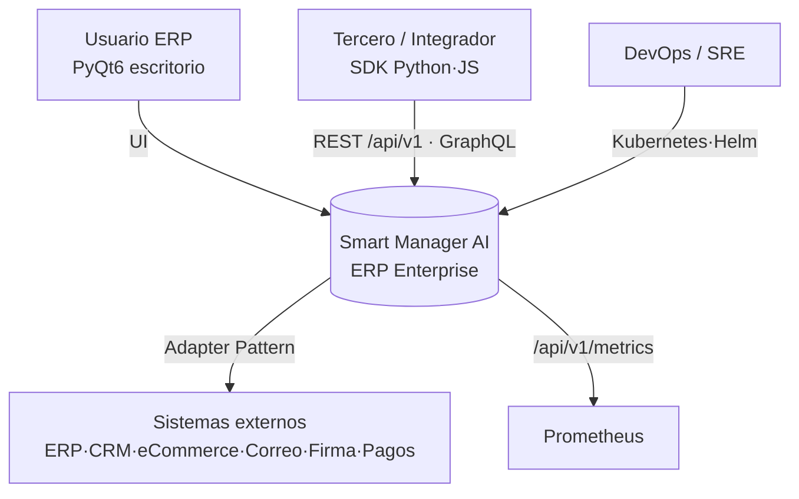
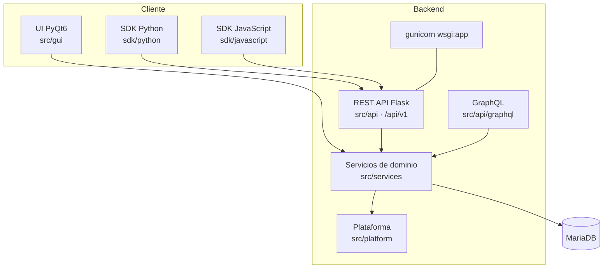
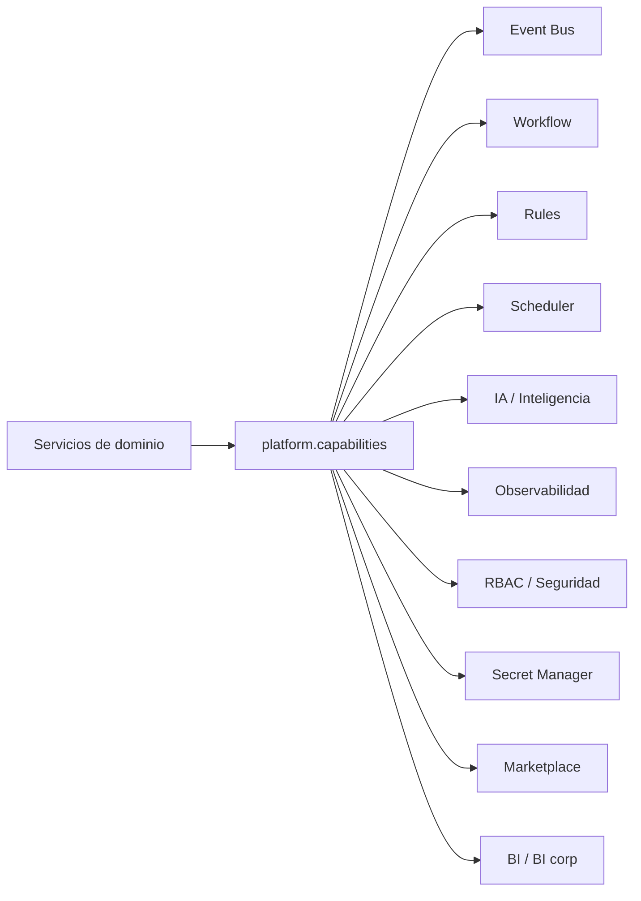
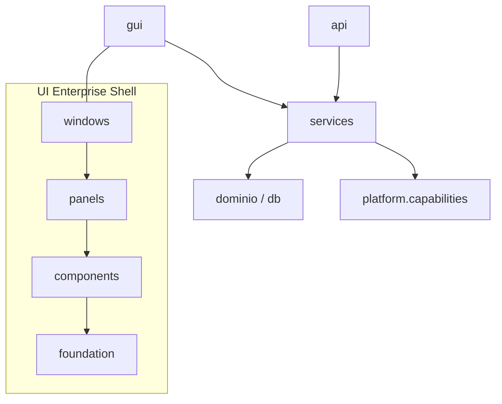
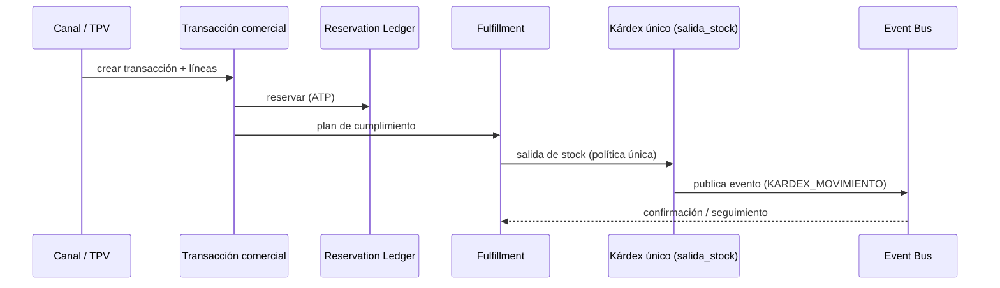
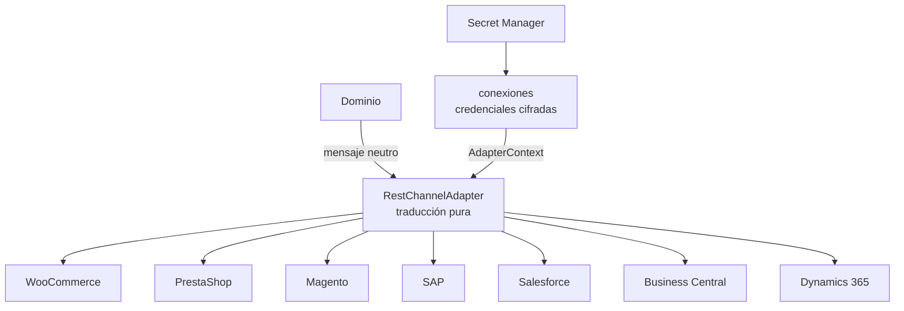
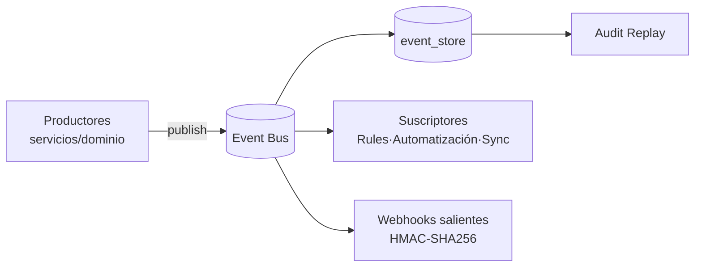
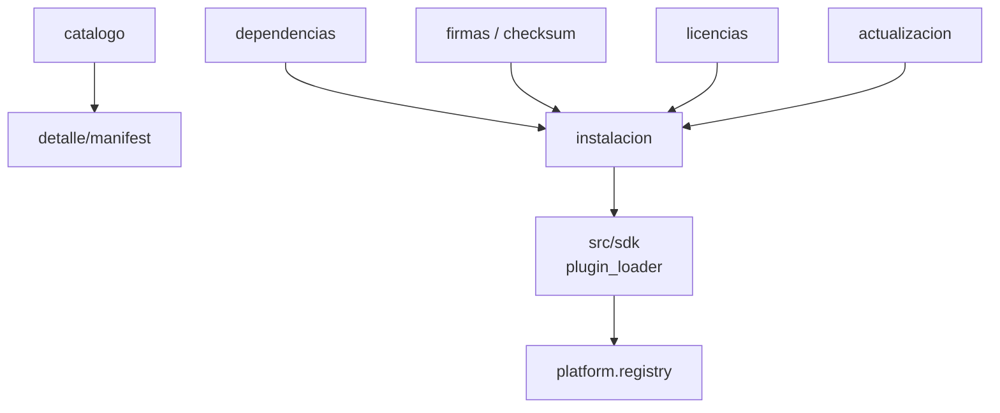
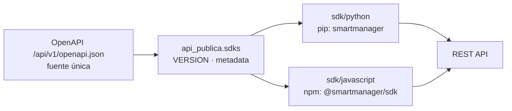
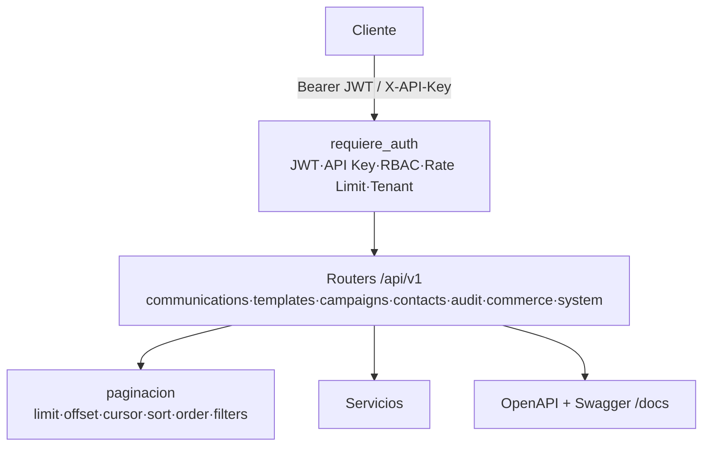

# Diagramas de arquitectura

Vistas de la arquitectura del ERP Enterprise en **Mermaid** (se renderizan en GitHub). Documentan la
estructura existente; ver el porqué en los [ADR](adr/).

## 1. Contexto (C4 nivel 1)

## 2. Contenedores (C4 nivel 2)

## 3. Componentes (servicios transversales — motores únicos, ADR-0002)

## 4. Dependencias (capas — dependencia estricta)

## 5. Flujo — venta → fulfillment (kárdex único)

## 6. Integraciones (conectores Enterprise, ADR-0008/0011)

## 7. Eventos (Event Bus, ADR-0006)

## 8. Marketplace de extensiones

## 9. SDK oficial (desde OpenAPI, ADR-0012)

## 10. API (superficie REST, ADR-0001/0010)

